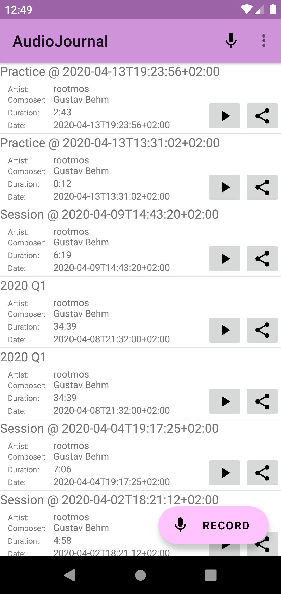
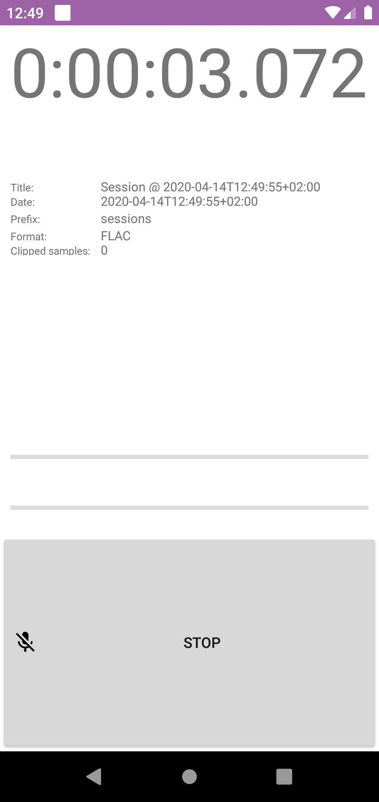

# AudioJournal

AudioJournal is an:
* Android app and Linux scripts to keep a diary of sounds
* 1-click recorder and uploader of jam/live/practice sessions to the cloud

## Android app
### Features
* PCM 16bit 48k recording
* FLAC and MP3 encoding
* metadata templates

### Screenshots
<p align="center">
  
  
</p>

### Links
* Inspired by [Audio Recorder](https://f-droid.org/en/packages/com.github.axet.audiorecorder/)
  by [axet](https://gitlab.com/axet)

## Linux script

### Usage
```
audio-journal

actions:
    -r      record (default)
    -l      listen
    -L      list
    -P SRC  publish as current mode (default: sessions)
    -h      show this message

options:
    -t TITLE    set title
    -d DATE     set date (during publish)
    -n          dry run (skip upload)

mode:
    -s       jam sesssion (default)
    -p       practice
    -R       release
    -m MODE  custom mode
```
